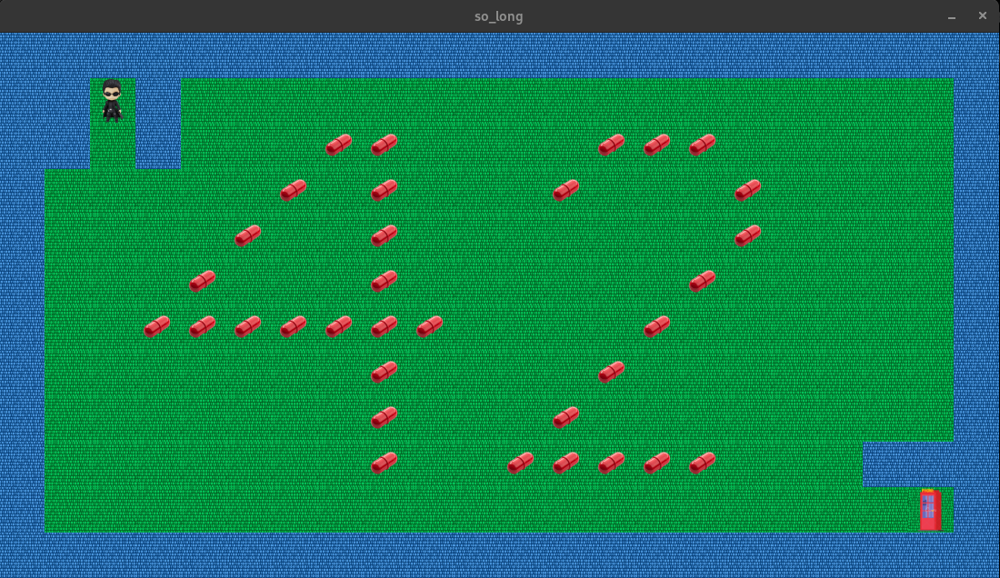

# so_long


**so_long** is a 2D game where the player navigates a character through a grid-based map, collecting items and avoiding obstacles. It is a project from the 42 curriculum that focuses on implementing a simple game using the C programming language with basic graphics using the **MinilibX** library.

## Table of Contents

- [Introduction](#introduction)
- [Features](#features)
- [Installation](#installation)
- [Gameplay](#gameplay)
- [Controls](#controls)

## Introduction

**so_long** is a 2D puzzle game in which the player must navigate through a maze-like environment. The goal is to collect all items (represented by collectible objects) and reach the exit while avoiding obstacles and enemies.

The project focuses on implementing key game development concepts like movement, interaction with objects, handling user input, and updating the display in real-time.

## Features

- **Player movement**: Move the player character up, down, left, and right.
- **Collectibles**: Collect items to increase your score.
- **Exit**: Reach the exit after collecting all the items to win the game.
- **Obstacles**: Avoid obstacles that can kill the player.
- **Map loading**: Load a map of the game world from a file.
- **Graphics**: Render the game world and player with basic graphical assets.

## Installation

To play **so_long**, clone the repository and compile the source files:

### Prerequisites

Ensure you have **MinilibX** installed on your system, which is used for rendering the graphics in this game. The **MinilibX** library is required for graphical rendering and can be obtained from the official 42 repository.

You need to clone the **MinilibX** library directly into your project directory.

### Steps to Install

1. Clone the **so_long** repository:

    ```bash
    git clone https://github.com/abboudje/so_long.git
    cd so_long
    ```

2. Clone the **MinilibX** library directly into the `so_long` folder:

    ```bash
    git clone https://github.com/42Paris/minilibx-linux.git lib/minilibx
    ```

3. Compile the project:

    ```bash
    make
    ```

4. Run the game with a `.ber` map file:

    ```bash
    ./so_long <map_file.ber>
    ```

    Replace `<map_file.ber>` with the path to the map file you want to use (usually a `.ber` file).

## Gameplay

The goal of **so_long** is to collect all collectible items on the map and reach the exit. The game environment is displayed on the screen, and you must navigate through the maze while avoiding obstacles and enemies.

### Key Features:
- The game loads a map from a `.ber` file, which contains walls, the player, the exit, and collectible items.
- You can control the player's movement and interact with the game world to collect items and reach the exit.

## Controls

- **W**: Move up
- **A**: Move left
- **S**: Move down
- **D**: Move right
- **Esc**: Quit the game
